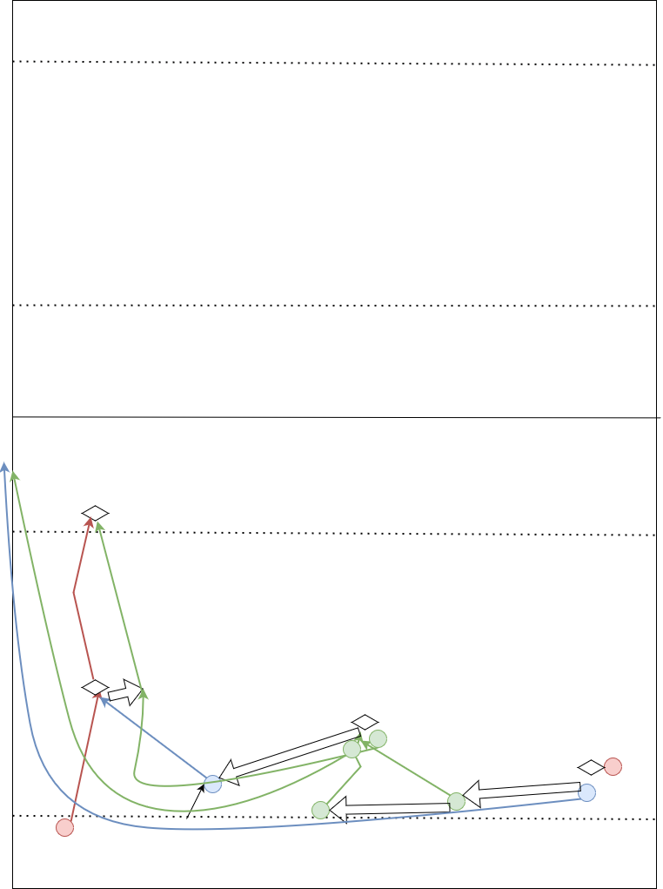

### 🔎 Focus:

32 short + Sub-drive.

### 🔥 Warm-up:

Pull Corner (Ganze Reihe)

4 a side Progression (Switch, Pass and wrap, Touch nehmen, Dummy line)

### ❗ Important Concepts:

* Sub drive: shift the play towards the sub box while gaining ground

### 💪 Excercises:

| No. | Name/Description | Which Basics |  |
|-----|------------------|--------------|--|
| 1 | Besprechung 20min |  | 20m |
| 2 | WU: Pull Corner |  | 5-10 |
| 3 | WU: 4 a side Progression |  | 10 |
| 4 | 32 short with Defense |  | 10 |
| 5 | sub-drive concept (cones/white board) |  | 5 |
| 6 | run the sub drive (all positions) |  | 15-20 |

### 🤏 Micro Skills Programm

.

### 🏗️ Progression within the session:

* gain confidence in 32 short running lines
* general idea of the sub-drive

### 🌱 Progression from one session to the next:

.